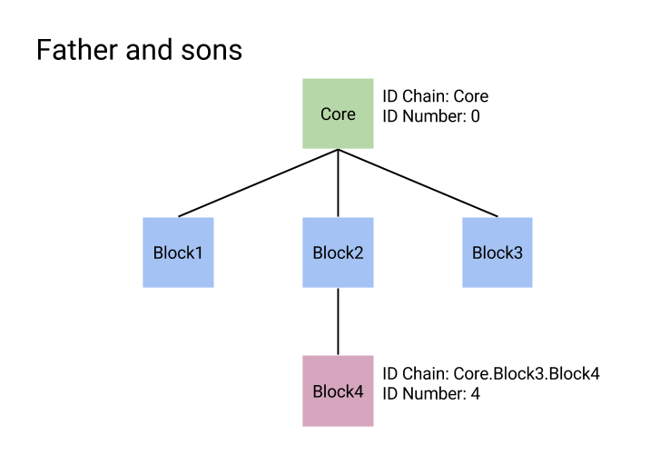
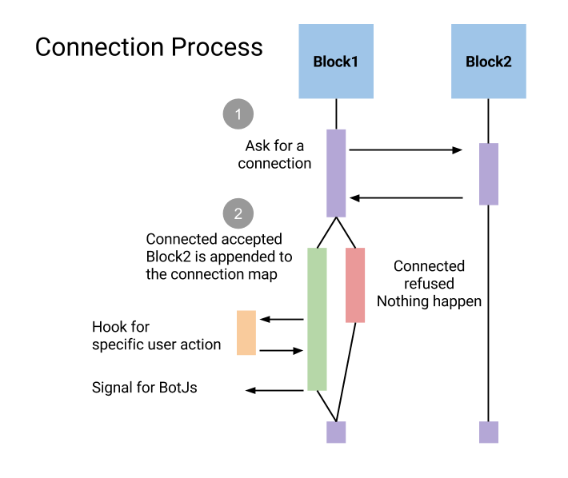

Block Interface
===============

BotBlock is the master interface for all components of BotJs.

## Block basic information

Basic information is a group of elements that provide basic block identification.

- **The version:** Decimal number that indicate the evolution state of the block.
- **The role:** String that define what type of job the block perform.
- **The type name:** The block class name without the "Block".
- **The name:** The name of the variable choosen by the user to identify the block.

## Block pointer management

BotJs architecture is based on a dynamic and flexible block composition. Therefore pointers are massively used and to make sure that it does not end in a huge memory mess some rules are imposed.

1. Shared pointers are used to store new blocks.
2. Only the father block can store the shared pointer.
3. Other blocks must use weak pointer and transform them in shared pointer localy.

A block hold a weak pointer on itself, this pointer is initialized at creation time just after the constructor. Functions to cast block pointers are provided by the interface. Many other parameters are initialized at creation time.

## Block father, block sons and block ID

A father block hold a shared pointer on every block it has created, those blocks are called sons. Two direct brother blocks cannot have the same name. This pyramidal architecture permit to identify each block with a unique string chain of name.

- **ID Chain:** The chain composed of every father of the block separated by a dot(Core.block1.blockused)
- **ID Number:** The unique ID number given by BotJs to each block.

## Connection

A Block can be connected to all other existing block. However if those block have affinities, they create a block synergy and they can perform action much more interresting.

To connect a block1 to a block2 use connect block1.connect(block2). Be carefull the direction may be important. block1.connect(block2) may be slightly different than block2.connect(block1).

When connected a weak pointer of the connected block is keept in the internal connection map.

## Interactive properties

An interactive property is a block variable that can be modified dynamically by the user through Js or a Gui.

A interactive property has a:

- **ID:**
- **Name:**
- **Type:**
- **Writable flag:**

## Log and talk

Each block can log its activities. Activities can be logged into a file or printed on the shell.

- **Log:** log in a file
- **Talk:** print on the shell

## Static members

## Signals
