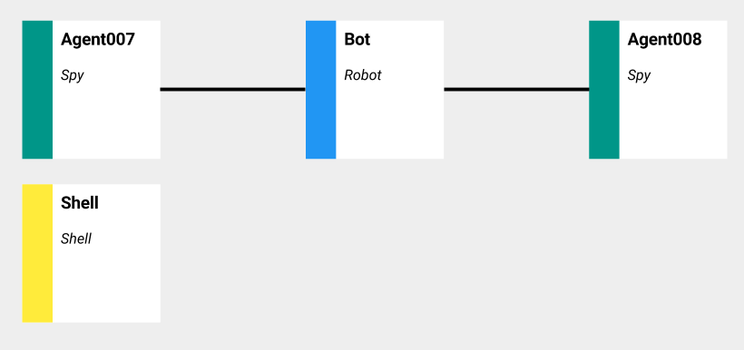
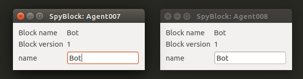

Tutorial 01: Data and Spy
=========================

This tutorial explain the role of data blocks and how to use the spy block.

## Introduction

The first type of block you need to learn is the RobotBlock. RobotBlock is a data block, it means the block provides data structure that can be used by other blocks. For example, RobotBlock provides a structure with general information about the robot.

The SpyBlock is a usefull block that allow to interact with any BotJs block. SpyBlock has a special feature when connected to DataBlock. It shows inside data of the block and provide a way to changed it dynamicaly.

To demonstrate the features of this two blocks, we are going to build a simple architecture with 1 RobotBlock and 2 SpyBlocks that spy the robot data.

## Block architecture

Every BotJs architecture can be represented as a block map.

Blocks in the color map have a color code:

- Blue : DataBlock
- Teal : SpyBlock
- Yellow : UiBlock



## Run the demo script

To run the demo

```bash
botjs script.js
```

Two windows corresponding to the two spies should be opened.



You can now change the name of the robot in one spy and you should see the name changed in the other spy.

## The SHELL

Through the shell you can access every created block.

```js
botjs> Bot.data.name = 'je suis charlie'
```

After you have executed this command, spies should have update their view to print the new name.
